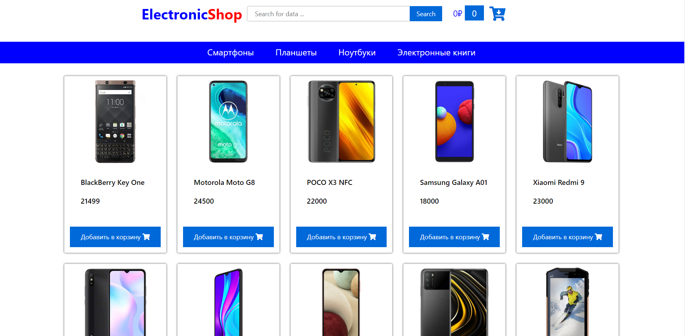

# ElectronicShop - учебный проект с применением Angular и Spring  
Главная страница:
  

Реализован следующий функционал:  
* Навигация между категориями 
* Просмотр товара  
* Добавление товара в корзину  
* Просмотр корзины

## Необходимый инструментарий  
Для запуска вам потребуется:  
* Java 11
* Maven  
* Node Js
* npm 
* Angular Cli 
* MySql или MariaDB

### Загрузка проекта: 
* Клонируйте или скачайте проект 
`git clone https://github.com/ScionRs/ElectronicShop.git`
### Импорт базы данных:  
* Импортируйте базу данных **eshop** в свою среду
### Frontend  
*  Установите Angular Cli:  
`npm install -g @angular/cli`  
* Запустите проект с помощью команды `ng serve` или `ng serve --open`
### Backend  
* Запустите проект c помощью  `mvn spring-boot:run` или посредством нажатия клавиш Shift + F10
